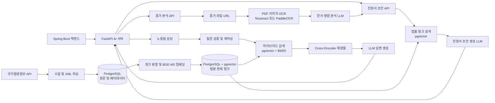

# WorkHelper AI Server


법률·행정 지원 서비스 WorkHelper의 AI 서버로, 노동법 상담, 증거 문서 분석, 임금체불 진정서 초안 작성과 법률 데이터 기반 검색을 제공합니다.

## 프로젝트 소개 및 접속 링크

- 프로젝트 소개: [내용 입력 필요]
- 서비스 접속 주소: [내용 입력 필요]
- API 문서: 로컬 실행 시 `http://localhost:8000/docs`
- 상태 확인: `http://localhost:8000/health`

## 팀 구성 및 역할 분담

| 구분 | 담당자 | 역할 |
| --- | --- | --- |
| AI 서버 개발 | [내용 입력 필요] | API, OCR, LLM 워크플로우 및 RAG 개발 |
| 데이터 파이프라인 | [내용 입력 필요] | 법령·판례 수집, 파싱, 임베딩 및 DB 적재 |

## 시연 영상 및 서비스 화면

| 구분 | 자료 |
| --- | --- |
| 시연 영상 | [내용 입력 필요] |
| 서비스 화면 |  |

## 주요 기능

- 이미지 및 PDF 증거 파일을 URL로 받아 OCR 처리하고, 추출 텍스트와 법적 쟁점 분석 결과를 반환합니다.
- 대화 내용과 선택적 증거 분석 결과를 바탕으로 임금체불 진정서 초안을 작성합니다.
- 노동법 상담 질문을 검증·재작성한 뒤 법령 및 판례 검색 결과에 기반해 답변합니다.
- 국가법령정보 공동활용 API에서 법령·판례를 수집하고 파싱하여 PostgreSQL에 저장합니다.
- 법령·판례 원문을 청크로 나누고 BGE-M3 임베딩을 생성해 pgvector 검색에 사용합니다.
- 벡터 검색과 BM25 키워드 검색 결과를 결합하고 Cross-Encoder로 재정렬합니다.

## 기술 스택

| 구분 | 기술 |
| --- | --- |
| 언어 및 API 서버 | Python 3.10, FastAPI, Uvicorn, Pydantic |
| LLM 및 체인 | LangChain, OpenAI API, Ollama |
| 데이터베이스 및 검색 | PostgreSQL, pgvector, psycopg, BM25, FlagEmbedding |
| 임베딩 및 재정렬 | `BAAI/bge-m3`, `BAAI/bge-reranker-v2-m3`, Sentence Transformers |
| OCR 및 문서 처리 | Tesseract, PaddleOCR, Pillow, PyMuPDF |
| 데이터 수집 | 국가법령정보 공동활용 API, Requests, lxml, Beautiful Soup |
| 실행 환경 | Docker, python-dotenv |

## 사용 외부 API

| API | 용도 | 인증 환경 변수 |
| --- | --- | --- |
| 국가법령정보 공동활용 Open API | 법령 및 판례 데이터 수집 | `LAW_OPENAPI_OC` |
| OpenAI API | 노동법 상담 및 선택형 문서 분석·초안 생성 | `OPENAI_API_KEY` |
| Ollama | 로컬 LLM을 사용하는 문서 분석·초안 생성 | `OLLAMA_BASE_URL` (인증 키 없음) |
| 증거 파일 제공 URL | 이미지·PDF 다운로드 및 OCR | 요청의 `fileUrl`에 포함된 접근 정보; 저장소 제공자와 인증 방식은 [내용 입력 필요] |

## 서비스 아키텍처



## API 명세

모든 라우트는 `/internal/ai` 아래에 등록됩니다. 요청·응답 필드는 FastAPI 문서에서 확인할 수 있습니다.

| Method | Endpoint | 설명 |
| --- | --- | --- |
| GET | `/health` | 애플리케이션 상태 및 실행 환경 확인 |
| GET | `/internal/ai/health` | AI API 라우터 상태 확인 |
| POST | `/internal/ai/consultation` | 질문과 대화 이력을 이용한 노동법 RAG 상담 |
| POST | `/internal/ai/evidence-analysis` | 파일 URL의 이미지·PDF OCR 및 쟁점 분석 |
| POST | `/internal/ai/document-draft` | 대화 및 선택적 증거 정보를 이용한 임금체불 진정서 초안 작성 |

## 프로젝트 디렉토리 구조

```text
.
├── app/
│   ├── api/v1/
│   │   ├── api.py
│   │   └── endpoints/
│   │       ├── consultation.py
│   │       ├── health.py
│   │       ├── ocr.py
│   │       └── petition.py
│   ├── db/
│   │   ├── connection.py
│   │   ├── embeddings.py
│   │   ├── reranker.py
│   │   └── retriever.py
│   ├── law/
│   │   ├── law_api_client.py
│   │   ├── law_chunk_ingestion.py
│   │   ├── law_ingestion.py
│   │   ├── law_parser.py
│   │   └── law_repository.py
│   ├── precedent/
│   │   ├── precedent_api_client.py
│   │   ├── precedent_chunk_ingestion.py
│   │   ├── precedent_ingestion.py
│   │   ├── precedent_parser.py
│   │   └── precedent_repository.py
│   ├── prompts/
│   │   ├── consultation_prompt.py
│   │   ├── ocr_prompt.py
│   │   └── petition_prompt.py
│   ├── schemas/
│   │   ├── consultation_schema.py
│   │   ├── ocr_schema.py
│   │   └── petition_schema.py
│   ├── services/
│   │   ├── consultation_service.py
│   │   ├── ocr_service.py
	│   │   └── petition_service.py
│   ├── utils/
│   │   ├── formatters.py
│   │   └── rag_tester.py
│   └── main.py
├── .env.example
├── Dockerfile
└── requirements.txt
```

## 시작하기 / 실행 방법

### 사전 요구사항

- Python 3.10
- PostgreSQL 및 `vector` 확장(pgvector)이 준비된 데이터베이스
- 상담 기능용 OpenAI API 키
- 로컬 LLM을 사용할 경우 Ollama와 사용할 모델 설치
- Tesseract OCR을 선택할 경우 시스템에 Tesseract와 한국어 언어 데이터 설치

### 설치 및 실행

```powershell
python -m venv .venv
.venv\Scripts\Activate.ps1
pip install -r requirements.txt
```

### 환경 변수 설정

`.env.example`을 참고해 프로젝트 루트에 `.env`를 만들고 실제 접속 정보로 설정합니다. DB 및 API 키 등 필수 값은 환경에 맞게 입력해야 합니다.

| 변수 | 용도 | 기본값 또는 비고 |
| --- | --- | --- |
| `POSTGRES_HOST` | PostgreSQL 호스트 | 필수 |
| `POSTGRES_PORT` | PostgreSQL 포트 | `5432` |
| `POSTGRES_DB` | 데이터베이스 이름 | `workhelper` |
| `POSTGRES_USER` | 데이터베이스 사용자 | `postgres` |
| `POSTGRES_PASSWORD` | 데이터베이스 비밀번호 | 필수 |
| `LAW_OPENAPI_OC` | 국가법령정보 API 사용자 식별값 | 데이터 수집 시 필요 |
| `OPENAI_API_KEY` | OpenAI API 키 | 상담 API에서 필요 |
| `USE_LOCAL_LLM` | 문서 분석·초안에 로컬 Ollama 사용 여부 | `true` |
| `OLLAMA_BASE_URL` | Ollama 서버 주소 | `http://localhost:11434` |
| `OLLAMA_MODEL_NAME` | Ollama 모델 이름 | `gemma2:2b` |
| `OPENAI_MODEL_NAME` | OpenAI 모델 이름 | `gpt-4o-mini` |
| `LLM_TEMPERATURE` | 문서 분석·초안 생성 온도 | `0.2` |
| `OCR_ENGINE` | OCR 엔진 (`tesseract` 또는 `paddleocr`) | `tesseract` |
| `OCR_PADDLE_ENABLE_MKLDNN` | PaddleOCR의 MKL-DNN 활성화 여부 | `false` |
| `PROJECT_NAME` | FastAPI 문서에 표시할 서비스 이름 | `WorkHelper AI Server` |
| `ENVIRONMENT` | 실행 환경 이름 | `local` |
| `BACKEND_CORS_ORIGINS` | CORS 허용 출처 목록 | 기본 로컬 출처 사용 |

현재 `.env.example`에는 일부 설정 항목이 코드의 실제 환경 변수명과 다를 수 있으므로, 위 표에 맞춰 값을 확인하세요. 특히 상담 기능은 현재 서비스 코드에서 OpenAI 모델을 직접 사용합니다.

### 애플리케이션 실행

```powershell
uvicorn app.main:app --reload
```

- API 문서: `http://localhost:8000/docs`
- 루트 확인: `http://localhost:8000/`
- 헬스체크: `http://localhost:8000/health`

Docker로 실행할 때는 PostgreSQL, LLM 서버 등 필요한 외부 서비스를 별도로 연결하고 환경 변수를 전달해야 합니다.

### 데이터 수집 및 임베딩 실행

DB와 `LAW_OPENAPI_OC`를 먼저 설정한 뒤 프로젝트 루트에서 순서대로 실행합니다.

```powershell
python -m app.law.law_ingestion
python -m app.law.law_chunk_ingestion
python -m app.precedent.precedent_ingestion
python -m app.precedent.precedent_chunk_ingestion
```

각 파이프라인은 원문 수집·저장 후 문서 청크와 임베딩을 DB에 적재합니다.

## 향후 개선 계획

- [내용 입력 필요: 프로젝트에서 계획 중인 개선 항목]
- [내용 입력 필요: 배포 및 운영 계획]
- [내용 입력 필요: 테스트 및 모니터링 계획]
